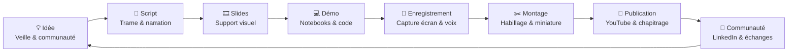

<div align="center">

<!-- Bannière : décommenter une fois le visuel ajouté dans assets/branding/

-->

# 🔦 Phare Data

### *La chaîne qui éclaire vos données*

**Le dépôt officiel de l'écosystème de production de contenu de la chaîne YouTube Phare Data :
scripts, présentations, notebooks, visuels et ressources de publication.**

[](https://www.youtube.com/@PhareData)
[](https://www.linkedin.com/company/111283551)
[](LICENSE)

[](https://www.microsoft.com/microsoft-fabric)
[](https://powerbi.microsoft.com)
[](https://www.python.org)


[🎬 Regarder la chaîne](https://www.youtube.com/@PhareData) •
[💼 Rejoindre la communauté](https://www.linkedin.com/company/111283551) •
[🗂️ Explorer le dépôt](#-structure-du-dépôt) •
[🤝 Contribuer](#-guide-de-contribution)

</div>

---

## 📑 Sommaire

- [À propos de Phare Data](#-à-propos-de-phare-data)
- [Thématiques de la chaîne](#-thématiques-de-la-chaîne)
- [Objet de ce dépôt](#-objet-de-ce-dépôt)
- [Structure du dépôt](#-structure-du-dépôt)
- [Contenus disponibles](#-contenus-disponibles)
- [Démarrage rapide](#-démarrage-rapide)
- [Workflow de production](#-workflow-de-production-de-contenu)
- [Identité et branding](#-identité-et-branding)
- [Communauté](#-communauté)
- [Guide de contribution](#-guide-de-contribution)
- [Feuille de route](#-feuille-de-route)
- [FAQ](#-faq)
- [Licence et réutilisation](#-licence-et-réutilisation)
- [Contact et réseaux](#-contact-et-réseaux)

---

## 💡 À propos de Phare Data

**Phare Data** est une chaîne YouTube francophone dédiée à la **data moderne** : plateformes,
gouvernance, ingénierie et intelligence artificielle appliquée aux données.

Comme un phare guide les navires, Phare Data éclaire les décisions techniques et
organisationnelles des équipes data : quelles architectures choisir, quels pièges éviter,
quels coûts anticiper, et comment industrialiser durablement.

### 🎯 Mission

> Rendre la data d'entreprise **claire, actionnable et durable**, en partageant des retours
> d'expérience terrain, des démonstrations reproductibles et des bonnes pratiques éprouvées —
> sans jargon inutile et sans discours marketing.

### 👥 À qui s'adresse la chaîne ?

| Profil | Ce que vous y trouverez |
|---|---|
| 🧑‍💻 **Data Engineers / Analytics Engineers** | Patterns d'ingestion, modélisation, CI/CD, notebooks prêts à l'emploi |
| 📊 **Data Analysts / Développeurs Power BI** | Modélisation sémantique, DAX, performance, adoption |
| 🏛️ **Architectes & Data Platform Owners** | Choix d'architecture, scalabilité, migrations, capacités |
| 🛡️ **Responsables gouvernance & sécurité** | Catalogage, lignage, conformité, sensibilité des données |
| 💰 **Managers & décideurs (FinOps)** | Maîtrise des coûts, ROI, dimensionnement des capacités |
| 🎓 **Étudiants & personnes en reconversion** | Fondamentaux expliqués, démonstrations pas à pas |

### 🗣️ Format & ligne éditoriale

- **Langue principale :** français 🇫🇷 (termes techniques conservés en anglais)
- **Formats :** tutoriels pas à pas, démonstrations live, décryptages d'actualité, retours d'expérience
- **Promesse :** des contenus concrets, reproductibles et testés en conditions réelles

---

## 🧭 Thématiques de la chaîne

<div align="center">

| | Thématique | Exemples de sujets |
|:--:|---|---|
| 🏗️ | **Microsoft Fabric** | Lakehouse, Warehouse, OneLake, Capacités, Domaines |
| 📊 | **Power BI** | Modèles sémantiques, DAX, Direct Lake, performance |
| ⚙️ | **Data Platform Engineering** | Architectures medallion, orchestration, industrialisation |
| 🛡️ | **Data Governance** | Catalogue, lignage, qualité, sensibilité, conformité |
| 🔍 | **Data Observability** | Monitoring, alerting, fiabilité des pipelines, SLA data |
| 💰 | **FinOps** | Coûts de capacité, optimisation, dimensionnement, ROI |
| 🔄 | **DataOps** | CI/CD, Git, environnements, tests automatisés, déploiement |
| 🤖 | **Copilot & IA** | Copilot dans Fabric/Power BI, IA générative appliquée à la data |
| 🧱 | **Analytics Engineering** | Modélisation, transformations, contrats de données |
| ☁️ | **Modern Data Platforms** | Comparatifs, migrations, interopérabilité, stratégie data |

</div>

---

## 🎯 Objet de ce dépôt

Ce dépôt est la **maison officielle du contenu de Phare Data**. Il centralise tout ce qui sert à
**préparer, enregistrer, publier et prolonger** chaque vidéo :

- 📝 **Scripts vidéo** — trames, storyboards et textes de narration
- 🎞️ **Présentations** — supports PowerPoint utilisés à l'écran
- 💻 **Code & notebooks** — démonstrations reproductibles (Fabric, Power BI, Python)
- 🎨 **Ressources visuelles** — miniatures, bannières, logos, overlays
- 📢 **Publications** — posts LinkedIn, descriptions YouTube, chapitrage
- 📚 **Ressources d'épisode** — liens, jeux de données et documentation associés

### Pourquoi en open source ?

1. **Transparence** — les démonstrations des vidéos sont vérifiables et reproductibles.
2. **Réutilisation** — les notebooks et supports servent directement dans vos projets.
3. **Communauté** — corrections, améliorations et idées de sujets sont les bienvenues.
4. **Traçabilité** — l'historique Git documente l'évolution des contenus.

---

## 🗂️ Structure du dépôt

Organisation cible du dépôt (les dossiers sont créés au fil des épisodes publiés) :

```text
pharedata/
├── README.md                     # Ce document
├── LICENSE                       # Licence MIT
│
├── episodes/                     # 🎬 Un dossier par épisode publié
│   └── YYYY-MM-DD-slug-episode/
│       ├── README.md             # Résumé, lien vidéo, prérequis, ressources
│       ├── script/               # Script et trame de narration
│       ├── slides/               # Présentation (.pptx / .pdf)
│       ├── code/                 # Notebooks, scripts, requêtes de démo
│       ├── assets/               # Miniature, captures, visuels de l'épisode
│       └── publication/          # Description YouTube, chapitrage, posts LinkedIn
│
├── notebooks/                    # 💻 Notebooks transverses et réutilisables
│   ├── CrossRegionMigration-Assessment.ipynb
│   └── CrossRegionMigration-Migration.ipynb
│
├── assets/                       # 🎨 Ressources de marque partagées
│   ├── branding/                 # Logos, bannières, palette, typographies
│   ├── youtube/                  # Modèles de miniatures, intro/outro, overlays
│   └── social/                   # Visuels LinkedIn et réseaux sociaux
│
├── templates/                    # 🧩 Modèles réutilisables
│   ├── script-template.md
│   ├── episode-readme-template.md
│   └── slides-template.pptx
│
└── docs/                         # 📚 Documentation du projet
    ├── CONTRIBUTING.md
    ├── CODE_OF_CONDUCT.md
    ├── STYLE_GUIDE.md            # Charte éditoriale et graphique
    └── ROADMAP.md                # Sujets à venir
```

> 💡 **Convention de nommage des épisodes :** `YYYY-MM-DD-sujet-en-kebab-case`
> (exemple : `2026-03-15-fabric-migration-cross-region`).

---

## 📦 Contenus disponibles

| Ressource | Description | Thématiques |
|---|---|---|
| [`CrossRegionMigration-Assessment.ipynb`](CrossRegionMigration-Assessment.ipynb) | Inventaire tenant-wide des capacités, espaces de travail et éléments Fabric, chargé dans un Lakehouse avec création automatique d'un modèle sémantique et d'un rapport d'analyse. | Microsoft Fabric, Gouvernance, Observabilité |
| [`CrossRegionMigration-Migration.ipynb`](CrossRegionMigration-Migration.ipynb) | Migration d'espaces de travail d'une capacité vers une autre (changement de région), incluant la gestion des modèles sémantiques volumineux. | Microsoft Fabric, Platform Engineering |

**Prérequis communs :** droits d'administrateur du tenant, XMLA Read/Write activé sur la capacité,
et la librairie [`semantic-link-labs`](https://github.com/microsoft/semantic-link-labs).

---

## 🚀 Démarrage rapide

1. **Regardez l'épisode associé** sur [YouTube](https://www.youtube.com/@PhareData) pour le contexte.
2. **Récupérez le dépôt :**
   ```bash
   git clone https://github.com/Pulsweb/pharedata.git
   cd pharedata
   ```
3. **Importez le notebook** souhaité dans un espace de travail Microsoft Fabric.
4. **Adaptez les paramètres** (identifiants de capacité, espaces de travail, noms d'éléments) en début de notebook.
5. **Exécutez cellule par cellule** en environnement de test avant toute utilisation en production.

> ⚠️ **Avertissement :** ces notebooks effectuent des opérations d'administration à l'échelle du
> tenant. Testez-les systématiquement sur un périmètre restreint. Ils sont fournis « en l'état »,
> sans garantie (voir la [licence](LICENSE)).

---

## 🔄 Workflow de production de contenu



| Étape | Livrable | Emplacement |
|---|---|---|
| 💡 Idée | Sujet validé, angle, promesse | `docs/ROADMAP.md` |
| 📝 Script | Trame détaillée, accroche, conclusion | `episodes/<épisode>/script/` |
| 🎞️ Slides | Présentation à la charte | `episodes/<épisode>/slides/` |
| 💻 Démo | Notebooks et scripts testés | `episodes/<épisode>/code/` |
| 🎥 Enregistrement | Rushes (hors dépôt) | — |
| ✂️ Montage | Miniature, visuels | `episodes/<épisode>/assets/` |
| 🚀 Publication | Description, chapitres, tags | `episodes/<épisode>/publication/` |
| 📢 Communauté | Posts LinkedIn, réponses | `episodes/<épisode>/publication/` |

---

## 🎨 Identité et branding

Les ressources de marque sont regroupées sous `assets/` afin de garantir une identité cohérente
sur toutes les plateformes :

| Dossier | Contenu |
|---|---|
| `assets/branding/` | Logos (clair/sombre), bannières, palette de couleurs, typographies, charte |
| `assets/youtube/` | Modèles de miniatures, bannière de chaîne, avatar, intro/outro, overlays |
| `assets/social/` | Visuels LinkedIn, formats carrés et paysage, citations |

**Règles d'usage :**

- ✅ Utiliser exclusivement les logos officiels, sans déformation ni recoloration.
- ✅ Conserver la palette et la typographie définies dans la charte.
- ✅ Exporter les miniatures en **1280 × 720 px** (16:9), poids < 2 Mo.
- ❌ Ne pas réutiliser les éléments de marque pour suggérer un partenariat inexistant.

> 📌 **Note aux mainteneurs :** les sources de l'identité visuelle et des assets YouTube sont
> aujourd'hui conservées hors dépôt (OneDrive local, dossiers `01-Identite` et `02-YouTube`).
> Les exports destinés au public doivent être copiés dans `assets/` pour que le dépôt soit
> autoportant et que les images du README s'affichent correctement.

---

## 🤝 Communauté

<div align="center">

| Plateforme | Pourquoi nous y rejoindre | Lien |
|---|---|---|
| ▶️ **YouTube** | Tutoriels, démos et décryptages | [@PhareData](https://www.youtube.com/@PhareData) |
| 💼 **LinkedIn** | Actualités data, échanges et coulisses | [Communauté Phare Data](https://www.linkedin.com/company/111283551) |
| 🐙 **GitHub** | Code, scripts et ressources des épisodes | [Pulsweb/pharedata](https://github.com/Pulsweb/pharedata) |

</div>

### Comment participer ?

- 🔔 **Abonnez-vous** à la chaîne et activez la cloche pour ne rien manquer.
- ⭐ **Mettez une étoile** à ce dépôt pour le retrouver facilement et le faire connaître.
- 💬 **Commentez** les vidéos : vos questions alimentent directement les prochains épisodes.
- 🗳️ **Proposez un sujet** via une [issue GitHub](https://github.com/Pulsweb/pharedata/issues).
- 🐛 **Signalez un problème** dans un notebook ou une ressource via une issue.
- 🔁 **Partagez** les contenus qui vous ont été utiles autour de vous.

---

## 🧑‍💻 Guide de contribution

Les contributions sont les bienvenues : corrections, améliorations de code, précisions
techniques ou idées de sujets.

### Démarche

1. **Ouvrez une issue** pour décrire le problème ou la proposition avant tout développement conséquent.
2. **Forkez** le dépôt et créez une branche : `feat/sujet`, `fix/sujet` ou `docs/sujet`.
3. **Respectez la structure** et les conventions de nommage décrites plus haut.
4. **Ouvrez une Pull Request** en expliquant le contexte et, si pertinent, l'épisode concerné.

### Bonnes pratiques

- 🧹 **Notebooks :** nettoyer les sorties (`Clear all outputs`) avant commit pour des diffs lisibles.
- 🔐 **Secrets :** aucun identifiant, jeton ou clé dans le code — utiliser des variables ou Azure Key Vault.
- 🕵️ **Données sensibles :** anonymiser noms de clients, tenants et jeux de données internes.
- 📁 **Nommage :** `kebab-case` pour les dossiers et fichiers, dates au format `YYYY-MM-DD`.
- 📝 **Documentation :** chaque épisode et chaque notebook porte un `README.md` ou une cellule d'introduction (objectif, prérequis, paramètres).
- 🎨 **Cohérence visuelle :** respecter la charte graphique pour tout support publié.
- 💬 **Commits :** messages clairs, idéalement au format [Conventional Commits](https://www.conventionalcommits.org/).

---

## 🗺️ Feuille de route

Sujets et chantiers envisagés pour le dépôt et la chaîne :

- [ ] Structurer les contenus existants par épisode (`episodes/`)
- [ ] Publier les modèles de script, de slides et de README d'épisode (`templates/`)
- [ ] Intégrer les exports de la charte graphique dans `assets/`
- [ ] Ajouter un index des épisodes avec liens vidéo et ressources
- [ ] Rédiger `CONTRIBUTING.md` et `CODE_OF_CONDUCT.md`
- [ ] Séries à venir : Fabric & FinOps, gouvernance, observabilité, Copilot

💡 Une idée de sujet ? [Ouvrez une issue](https://github.com/Pulsweb/pharedata/issues) — la
communauté vote et oriente la programmation.

---

## ❓ FAQ

<details>
<summary><strong>Puis-je réutiliser le code dans mes projets professionnels ?</strong></summary>

Oui. Le code est publié sous licence MIT : vous pouvez l'utiliser, le modifier et le
redistribuer, y compris commercialement, en conservant la mention de licence. Il est fourni
sans garantie : testez-le avant toute mise en production.
</details>

<details>
<summary><strong>Les vidéos sont-elles en français ?</strong></summary>

Oui, la chaîne est francophone. Les termes techniques restent en anglais afin de correspondre
à la documentation officielle et aux interfaces des produits.
</details>

<details>
<summary><strong>Comment proposer un sujet de vidéo ?</strong></summary>

Ouvrez une [issue GitHub](https://github.com/Pulsweb/pharedata/issues), commentez une vidéo
YouTube ou réagissez sur [LinkedIn](https://www.linkedin.com/company/111283551).
</details>

<details>
<summary><strong>Les ressources de marque sont-elles réutilisables ?</strong></summary>

Non. Le code et la documentation sont sous licence MIT, mais les logos, bannières et éléments
d'identité visuelle de Phare Data restent la propriété de leur auteur et ne peuvent pas être
réutilisés pour représenter un autre projet ou suggérer un partenariat.
</details>

<details>
<summary><strong>Proposez-vous des partenariats ou du sponsoring ?</strong></summary>

Pour toute proposition de collaboration, sponsoring ou intervention, contactez-nous via
[LinkedIn](https://www.linkedin.com/company/111283551).
</details>

---

## 📄 Licence et réutilisation

- **Code, notebooks et documentation :** [licence MIT](LICENSE) — réutilisation libre avec
  mention de la licence.
- **Identité visuelle, logos et miniatures :** tous droits réservés, usage réservé à Phare Data.

Si ces ressources vous sont utiles, un lien vers la chaîne ou le dépôt est toujours apprécié 🙏

---

## 📬 Contact et réseaux

<div align="center">

[](https://www.youtube.com/@PhareData)
[](https://www.linkedin.com/company/111283551)
[](https://github.com/Pulsweb/pharedata)

**Questions techniques :** [Issues GitHub](https://github.com/Pulsweb/pharedata/issues) •
**Collaborations & partenariats :** [LinkedIn](https://www.linkedin.com/company/111283551)

</div>

---

<div align="center">

### 🔦 Phare Data — *La chaîne qui éclaire vos données*

**Comme un phare guide les navires, Phare Data éclaire vos décisions data.**

⭐ *Ce dépôt vous est utile ? Ajoutez une étoile et abonnez-vous à la chaîne.*

[▶️ YouTube](https://www.youtube.com/@PhareData) •
[💼 LinkedIn](https://www.linkedin.com/company/111283551) •
[🐙 GitHub](https://github.com/Pulsweb/pharedata)

<sub>© 2026 Romain Casteres — Code et documentation sous licence MIT · Identité visuelle : tous droits réservés</sub>

</div>
